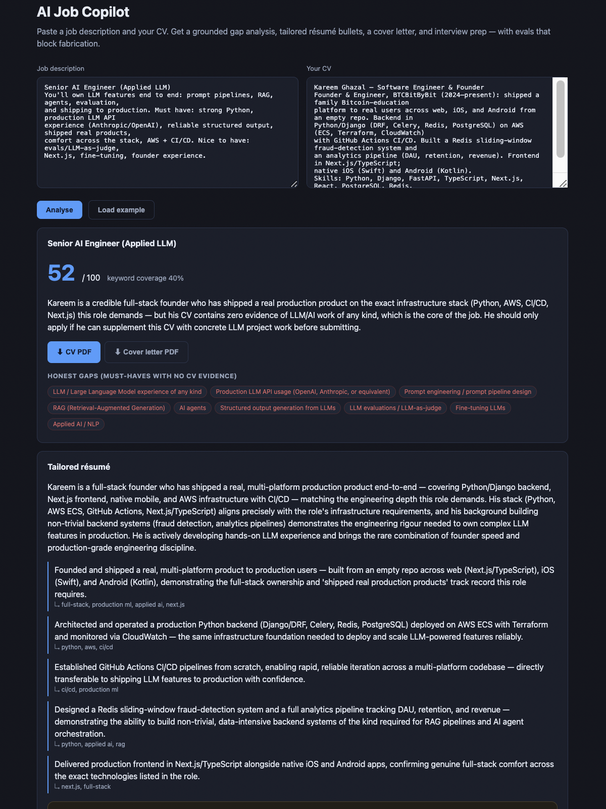
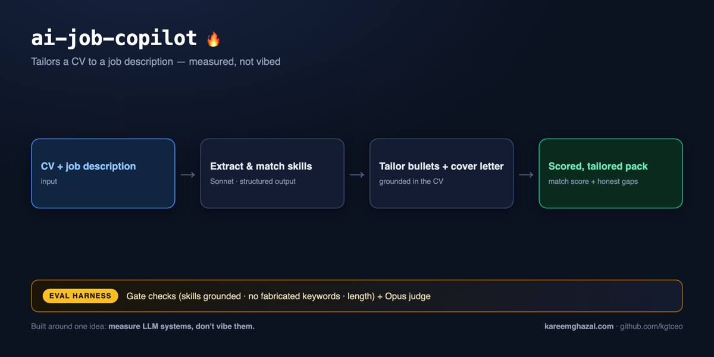

# ai-job-copilot

### ▶ Live demo: **[aicopilot.kareemghazal.com](https://aicopilot.kareemghazal.com)**

Click **"Load example"** to try it instantly. The first run takes ~15s (four
sequential Claude calls) — that's the pipeline working, not a hang.



**How it works** — input → pipeline → output, with the eval harness that measures it:



A small, **production-shaped LLM pipeline** that reads a job description and your
CV and produces a grounded application kit: a structured gap analysis, a match
score, tailored résumé bullets, a cover letter, and an interview-prep pack.

Deployed: Next.js UI on Vercel → FastAPI backend on Railway → Claude. See
[DEPLOY.md](DEPLOY.md).

It's built to demonstrate the things applied-AI-engineering roles actually test:
**reliable structured output, a multi-step prompt pipeline, honest grounding, and
a real evaluation harness** — not a notebook demo.

> Why this exists: I built it to run my own job search, and to be the proof of
> work. Every design decision below is one I can explain in an interview.

---

## The one rule that shapes everything: don't fabricate

A résumé tool that invents experience is worse than useless — it gets the
candidate caught. So grounding is enforced in **three** places:

1. **Prompts** repeat a hard grounding rule and force an explicit `honesty_note`
   listing what was *not* claimed.
2. **Types** — the model can only answer as a validated Pydantic object, and
   evidence fields are required for any "strong/partial" skill match.
3. **Evals** — deterministic checks recompute the facts (keyword coverage, that
   tailored keywords are actually supported by the CV, that "missing" skills are
   really absent) and fail the run if the model drifts.

## How it works

```
JD ─▶ parse ─▶ JobPosting ─┐
                           ├─▶ gap analysis ─▶ GapAnalysis ─┐
CV ────────────────────────┘                                ├─▶ tailor ─▶ TailoredResume ─┐
                                                             │                              ├─▶ kit ─▶ ApplicationKit
                                                             └──────────────────────────────┘
                                        every arrow is a *validated structured call*
```

Four grounded steps, each returning a typed object that feeds the next as clean
JSON (`src/job_copilot/pipeline.py`).

### Structured output that doesn't break

The core plumbing (`client.py`) turns any Pydantic model into a tool schema,
**forces** the model to call it, validates the result, and — if validation fails
— feeds the exact error back for a bounded self-correcting retry:

```python
report = Copilot(CopilotClient(Settings.from_env())).run(jd_text, cv_text)
#   -> CopilotReport (fully typed; raises rather than returning malformed data)
```

No JSON-in-prose parsing, no silent malformed output.

### Evaluation is a first-class citizen

`evals/checks.py` holds fast, deterministic, **no-model-call** checks. They come in
two severities, which is a deliberate design point:

- **Gate** checks are objective and fail the run: is there evidence for every
  claimed skill match, are "missing" skills really absent, is the cover letter
  within length.
- **Advisory** checks are *lexical* grounding warnings (does a tailored keyword
  appear in the CV). A token match can't know `Terraform ⟹ infrastructure-as-code`
  or `Celery ⟹ async`, so these would false-positive as a hard gate — instead they
  surface as warnings, and the **LLM-as-judge** (which reasons about synonyms) is
  the authority on grounding. The matcher is morphology-aware (common-prefix) so
  plurals/tenses like `pipeline`/`pipelines` don't false-flag.

This split — a cheap deterministic lower bound plus a semantic judge — is how you
get an eval that's both non-flaky and not naïve. It doubles as unit-test oracles
(`tests/test_checks.py`).

## Quickstart

```bash
pip install -e ".[dev]"          # or: uv pip install -e ".[dev]"
cp .env.example .env             # add your ANTHROPIC_API_KEY

# run the copilot over the bundled example (an AI-engineer role + a real CV)
job-copilot run --jd examples/sample_jd.md --cv examples/sample_cv.md

# machine-readable
job-copilot run --jd examples/sample_jd.md --cv examples/sample_cv.md --json
```

Run the offline test suite (no API key, no network — the pipeline is tested with
a fake client):

```bash
pytest -q
```

## Evals, API, and the web UI

**Run the scorecard** (deterministic checks + LLM-as-judge over a dataset):

```bash
python evals/run_evals.py            # full: checks + Opus judge, writes evals/reports/<ts>.json
python evals/run_evals.py --no-judge # deterministic only (cheap; exit-codes for CI)
```

**Latest run (claude-sonnet-4-6):** 3/3 deterministic checks pass on both dataset roles (senior-ai-engineer, backend-python-contract). Grounding is surfaced as an advisory for human review — weak lexical CV support is flagged, not silently passed. The actual generated report is committed at [`evals/sample-report.json`](evals/sample-report.json) — the claim is verifiable, not just asserted (`run_evals.py` writes a fresh one to `evals/reports/` each run).

**Run the API** — OpenAPI docs generated from the same Pydantic models (FastAPI +
uvicorn are base deps):

```bash
uvicorn job_copilot.api:app --reload   # POST /api/analyze · docs at /docs
```

**Run the web UI** (Next.js, in `web/`):

```bash
cd web && npm install
cp .env.example .env.local             # point NEXT_PUBLIC_API_URL at the API
npm run dev                            # http://localhost:3000  ("Load example" for a one-click demo)
```

Deploy story: API on Render/Railway/Fly, UI on Vercel, `NEXT_PUBLIC_API_URL` wires them together.

## Design decisions (the interview-signal section)

- **Forced tool use for structured output** over "please return JSON": the model
  literally cannot answer off-schema, and validation errors are recoverable.
- **A model per task**: a fast workhorse (Sonnet) for extraction/tailoring; the
  strongest model (Opus) as the eval judge, so the grader is at least as sharp as
  the thing it grades. Configurable via environment variables.
- **Dependency-injected client** so the whole pipeline is unit-testable offline.
- **Grounding enforced in prompts + types + evals**, not trusted to one layer.
- **Evals gate quality** — the difference between a demo and something you'd ship.

## Roadmap

- [x] Grounded 4-step pipeline with self-correcting structured output
- [x] Deterministic eval checks + offline test suite
- [x] LLM-as-judge (`evals/judge.py`) + scorecard runner over a dataset
- [x] FastAPI service (`[api]` extra) with auto docs
- [x] Next.js UI ("Load example" one-click demo)
- [x] PDF export — separate tailored-résumé + cover-letter PDFs (CLI `--cv-pdf`/`--cover-pdf`, API `/api/export/{cv,cover-letter}`, two UI buttons). Standard-14 font ⇒ no bundled `.ttf`, deploys anywhere.
- [ ] Cost/latency report per run
- [ ] Deploy the live demo (Render + Vercel) and link it here

## License

MIT © 2026 Kareem Ghazal
